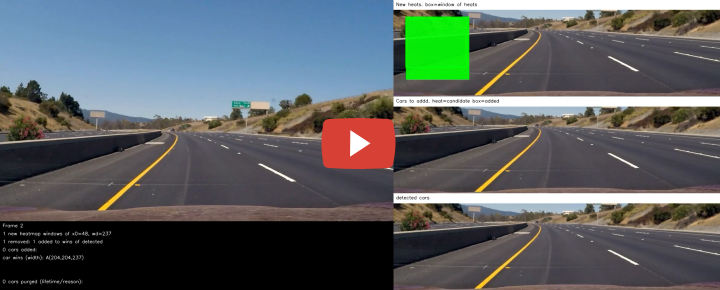

**Vehicle Detection Project**

The goals of this [project](https://github.com/udacity/CarND-Vehicle-Detection) are as follows:

- Perform a Histogram of Oriented Gradients (HOG) feature extraction on a labeled training set of images and train a classifier Linear SVM classifier
- Explore other features in additional to HOG
- Implement a sliding-window technique and use your trained classifier to search for vehicles in images
- Run pipeline on a video stream and create a heat map of recurring detections frame by frame to reject outliers and follow detected vehicles
- Estimate a bounding box for vehicles detected

[//]: # (Image References)
[img1]: assets/car_not_car.png
[img2]: assets/hog9.jpg
[img3]: assets/hog10.jpg
[img4]: assets/hog11.jpg
[img5]: assets/hog12.jpg
[img6]: assets/sliding_windows_330.jpg
[img7]: assets/frame-656-pipeline.jpg
[img8]: assets/singleimage-pipeline.jpg
[img9]: assets/frame-262-Q.jpg
[img10]: assets/frame-266-Q-gone.jpg

---
### Files

The python source files:

- `run.py` - process `project_video.mp4` and writes labeled `outputvid.mp4` to file.
- `train.py` - train model on training data and saves model to file.
- `config.py` - configuration for training and vehicle detection in video
- `draw_sliding_windows.py` - draw out sliding windows on an image
- `draw_features.py` - draw a hog visualization image
- `lib/detection.py` - vehicle detection library, contains the detection pipeline
- `lib/feature_extraction.py` - feature extraction functions
- `lib/draw.py`, `lib/color_palette.py` - drawing functions and colors
- `lib/np_util.py`, `lib/helpers` - helper functions

The data files (Note the `..` in the data paths. If `data/` is not in `..`, modify `config.py` accordingly):

- `../data/vehicles/` - cars
- `../data/non-vehicles/` - not cars

---
### Histogram of Oriented Gradients (HOG)

Histogram of Oriented Gradients (HOG) features is used to extract features to identify cars in images.

`config.py` defines the parameters used for HOG features extraction. 

Exploration of different color spaces and `skimage.hog()` parameters (`orientations`, `pixels_per_cell`, and `cells_per_block`) are in table below.
Various few combinations of parameters have been tried and here are the results.

| Color Space | Spatial Bins | Color Hist Bins | HOG Orientations | Pixs/Cell, Cells/Blk | Feature Vector Len | Test Accuracies (best if rand seed) | Result |
| :---: | :---: | :---: | :---: | :---: | :---: | :---: | :---: |
| LUV | (32,32)| 32 | 12 | 8,2 | 10224 | 0.993 | |
| LUV | (32,32)| 32 | 10 | 8,2 | 9048 | 0.9941 | Lots more false positives and non detects|
| LUV | (32,32)| 32 | 9 | 8,2 | 8460 | 0.9916 | |
| YCrCb | (32,32)| 32 | 12 | 8,2 | 10224 | 0.9935 | |
| YCrCb | No | No | 12 | 8,2 | 7056 | 0.9893 | Many none detects |
| YCrCb | (32,32)| 32 | 10 | 8,2 | 9048 | 0.9921 | |
| YCrCb | (32,32)| 32 | 9 | 8,2 | 8460 | 0.9921 | |

Overall it seems LUV 12 orientations gives the best result. I was not able to see better results on 10 orientations nor on no spatial bins and no color histogram bins as my reviewer suggests.

Here is an example of one of each of the `vehicle` and `non-vehicle` classes:

![][img1]

*Fig 1. Car and Not Car*

Here is a visualization of different HOG orientations  

![][img2]

*Fig 2. HOG Orientation=9*

![][img3]

*Fig 3. HOG Orientation=10*

![][img4]

*Fig 4. HOG Orientation=11*

![][img5]

*Fig 5. HOG Orientation=12*

---
### Sliding Window Search

The idea of the sliding window search is to slide different sized windows across the screen to detect if the area of the window contains a car or not.

First, positioning of where the windows will slide needs to be determined. Windows, especially smaller ones can not be slided across the screen as doing so can take up to an hour to process just one second of video. The observation is that cars vanish toward a vanishing point and that point is near the center of the screen.

Once this point, or more specifically this horizontal line is determined, it is easy to visualize that the smallest windows will slide horizontally centered along this line and that the same window size does not need to be slided any further up or down from this vertical position. The next deduction is that the next window size up will need to be slided slightly more down vertically than up.

Coding it in a function that returns these bounding box positions will be helpful. This is done in `bbox_rows` function in `feature_extraction.py`. Here instead of starting from smallest window, I start from biggest and work my work until I cross the threshold of 80 x 80. Any smaller than that won't be that useful as the cars are far away.

The `xstep` is the number of steps within a window in the x direction. I start off with 10 steps but the detection is not great, so I ended up with 20. In the y direction, since I start with big windows first, it is easy to think of this in terms of percentage of height to go up. 20% is a good number here. 

To visualize these windows, `draw_sliding_windows.py` is created to draw them overlaying test1.jpg. Below is the result.

![][img6]

*Fig 6. Sliding windows*

`find_hot_wins` method in `detection.py` is where `bbox_rows` is called to find cars With these sliding windows. Boxes of heat that overlap will generate bounding windows of overlap heats. These windows are where cars may be found.  

---
### Pipeline in action

Here is an example of pipeline in action. The top window shows the output of `find_hot_boxes` as described above, in which the small heat box overlaps the bigger one and so the frame generates this new window of possible car. 

This window is matched against all existing cars to see if it can be group with any of them. Since the car has already been found previously, the window is associated with that car and no new car is added as shown in second window.

The last window is a threshold of window of windows associated with the car. More on this below.

![][img7]

*Fig 7. Frame 656 Pipeline*

Here's one where the pipeline is ran on a single image. Since there are no previous car found, the second image shows that the hot windows are added as new detections.

![][img8]

*Fig 8. Pipeline on Single Image*

---
### False Positives Filtering and Overlap of Detected Windows

False positives filtering is done in as follows in `detection.py`:

1. In `find_hot_wins` method, a threshold of 2 is used to filter out non overlapping heat bounding boxes. Value of 1 (no overlap needed) and 3 has been tried. 1 produces many false positives and 3 failed to detect some windows.

2. The heat windows that passes the above test is checked to see if it is too wide, too narrow, or too tall. This is done in the `detect` method.

3. Once the windows passed the above tests, they are added as detected cars in memory but won't be show as detected yet. Cars that are rendered need to pass more purge filters.

4. Those with too many empty consecutive frames (consecutive no-detection new frames) are then removed in `purge` method.

5. All the windows in past frames (15 frames max) associated with detected cars are overlapped to generate a new window of windows heatmap. If less than 3 windows overlap, the car is not shown as detected in `final_purge_and_detection_image` method.

6. If the windows of windows is disjoint, the car is removed as windows of car should not be disjoint.

7. Next, if window of windows is too small, narrow, or big, it is removed.

`bboxes_of_heat` function in `feature_extraction.py` is where overlapping bounding boxes are combined. It calls `scipy.ndimage.measurements.label()` which returns an array of labels that is of the same dimension as the image. These label values indicates if which of the heat areas are continuous. This information is used to constructed bounding boxes to cover the area of each blob detected.  

Here is an example of false position in action

![][img9]

*Fig 9. Frame 262 - possible car 'Q' detected*

The possible car 'Q' removed due to 3 consecutive empty frames while its lifetime frames is only 5.

![][img10]

*Fig 10. Frame 266 - possible car 'Q' removed*

---
### How to Run

Edit `run.py` to specify the video_in file to run pipeline on video. Set it to False to run pipeline on a single image.

---
### Output Video 

")

---
### Thoughts

My first thought for this project is it should be simpler than previous Advanced Lane Lines project. In a sense it should be as I look back and compare the two. However, due to the long feedback loop of running the video, getting stuck in various errors, and creating a good side and bottom windows system to better troubleshoot and optimize the detection, false positives and purge, the end result is I have once again spent too much time on this. All this effort may not worth it if some Deep Learning method deem this classical method irrelevant. The model is too brittle. All the magic parameters are tunned to just this one video. There's probably much better classical models out there, but I'm leaning towards believing that Deep Learning methods will surpass classical ones, if not already.

